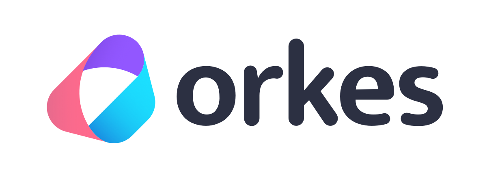

## Orkes Platform is a cloud hosted, fully managed version of Netflix Conductor offering full compatibility with the open source version.

## Visit our website at [orkes.io](https://orkes.io)
## Read about Conductor in our [docs](https://orkes.io/content/)
## Download the [open source](https://github.com/Netflix/conductor)

<!--

**Here are some ideas to get you started:**

🙋‍♀️ A short introduction - what is your organization all about?
🌈 Contribution guidelines - how can the community get involved?
👩‍💻 Useful resources - where can the community find your docs? Is there anything else the community should know?
🍿 Fun facts - what does your team eat for breakfast?
🧙 Remember, you can do mighty things with the power of [Markdown](https://docs.github.com/github/writing-on-github/getting-started-with-writing-and-formatting-on-github/basic-writing-and-formatting-syntax)
-->
